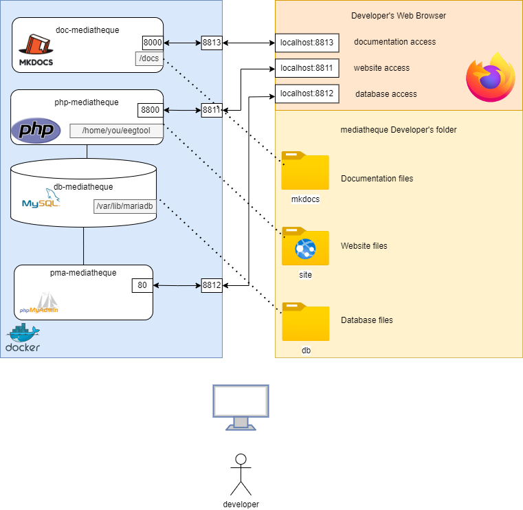

# Mediatheque Architecture dev

# Description

The Dev env is made of 4 containers:

* db-mediatheque : a MySql database
* php-mediatheque : a php server containing Symfony website code
* pma-mediatheque : phpmyadmin tool for database administration
* doc-mediatheque : an mkdoc-material documentation for Mediatheque project

They are created using the docker-compose.yml file. 

Three volumes are defined in order to keep database data (db folder), website data (www folder) and mkdoc data (docs folder) on the dev's computer
