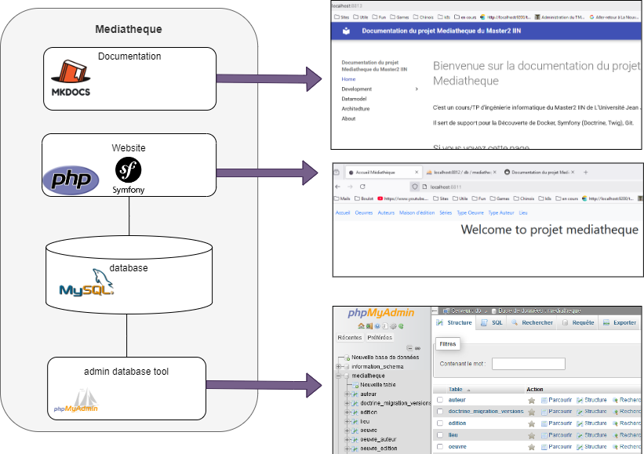

# Welcomme on M2IIN Mediatheque project Documentation

It's a Computer engineering project for Master2 IIN at Université Jean Jaures. 
Support for the discovery of Docker, Symfony (Doctrine, Twig), Git. 

## If you see this page

* You succeed in cloning the project with 

`git clone https://github.com/yaelchampclaux/ProjetMediatheque.git`

* You succeed to execute dev env with 

`docker-compose -f docker-compose_x86.yml up --build`

You must have followed recommandations [Here](dev.md)

## You can accesss to  website, documentation and phpMyAdmin tool 

* <a href="http://localhost:8811/">Website</a> (http://localhost:8811/)
* <a href="http://localhost:8812/">PhpMyAdmin</a> (http://localhost:8812/)
* <a href="http://localhost:8813/">Documentation</a> (http://localhost:8813/)

